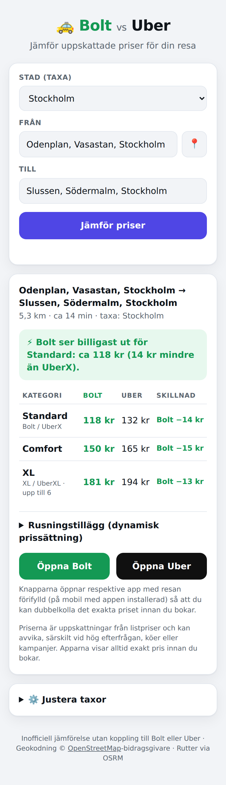

# 🚕 Bolt vs Uber – prisjämförelse

En webbapp som jämför **uppskattade priser för Bolt och Uber** i svenska städer.
Ange var du är och vart du ska, så räknar appen ut rutten och visar vad resan
ungefär kostar med båda tjänsterna – kategori för kategori – och vilket som ser
billigast ut. Därifrån öppnar du rätt app med resan förifylld.

> **Obs:** "Volt" i uppdraget har tolkats som **Bolt** – taxitjänsten som
> konkurrerar med Uber i Sverige.



## Funktioner

- 🔍 **Adressökning med förslag** (OpenStreetMap/Nominatim) och 📍-knapp för din
  nuvarande position
- 🗺️ **Verklig körrutt** via OSRM med sträcka och restid, ritad på karta
  (Leaflet) – med fågelvägs-fallback om ruttjänsten inte kan nås
- 💰 **Pris per kategori**: Standard (Bolt/UberX), Comfort och XL, med tydlig
  markering av vilken tjänst som är billigast och hur mycket
- ⚡ **Rusningsreglage** per tjänst för att simulera dynamisk prissättning
- ⚙️ **Justerbara taxor** per stad (startavgift, kr/km, kr/min, minimipris) som
  sparas lokalt i webbläsaren – kalibrera mot dina senaste kvitton
- 📲 **Djuplänkar** som öppnar Bolt- respektive Uber-appen med resan förifylld
- 🌙 Mörkt läge, mobilanpassad, ingen backend och inga API-nycklar

Städer med inbyggda taxor: Stockholm, Göteborg, Malmö och Uppsala.

## Kom igång

Appen är helt statisk – inga byggsteg, inget npm.

```bash
# valfritt alternativ:
open index.html                # öppna direkt i webbläsaren
python3 -m http.server 8000    # eller servera lokalt → http://localhost:8000
npx serve .                    # eller med node
```

Vill du ha den på nätet: aktivera **GitHub Pages** för repot (Settings → Pages
→ Deploy from branch) så serveras `index.html` direkt.

## Hur priserna räknas ut

Varken Bolt eller Uber har öppna pris-API:er, så appen använder samma formel
som tjänsterna själva redovisar för sina taxor:

```
pris = max(minimipris, startavgift + kr/km × sträcka + kr/min × restid) × rusningsfaktor
```

- **Sträcka och restid** hämtas från OSRM:s publika ruttjänst (restiden skalas
  upp 20 % eftersom OSRM är optimistisk i stadstrafik). Om tjänsten inte nås
  används fågelväg × 1,35 och en antagen snittfart, tydligt markerat i
  resultatet.
- **Taxorna** är riktvärden (listpriser utan rusning) och kan glida över tid –
  därför är de redigerbara under *Justera taxor* och sparas i `localStorage`.
- **Rusningstillägg** (surge) varierar minut för minut och kan inte hämtas
  externt; använd reglagen för att simulera, och dubbelkolla alltid det exakta
  priset i apparna innan du bokar – knapparna tar dig dit med resan ifylld.

## Teknik

| Del | Val |
|---|---|
| Frontend | Vanilla HTML/CSS/JS, inga beroenden att installera |
| Geokodning | [Nominatim](https://nominatim.org/) (OpenStreetMap) |
| Ruttberäkning | [OSRM](http://project-osrm.org/) demoserver |
| Karta | [Leaflet](https://leafletjs.com/) via CDN (appen fungerar även utan) |
| Prislogik | `pricing.js` – ren modul som delas mellan webbläsare och tester |

## Tester

```bash
node test/pricing.test.cjs
```

Testar prisformeln, minimipriser, rusningsfaktorer, jämförelselogiken,
sammanslagning av sparade taxejusteringar samt avstånds-fallbacken.

## Ansvarsfriskrivning

Detta är en inofficiell jämförelse utan koppling till Bolt eller Uber.
Alla priser är uppskattningar; det pris som visas i respektive app vid
bokningstillfället är det som gäller.
