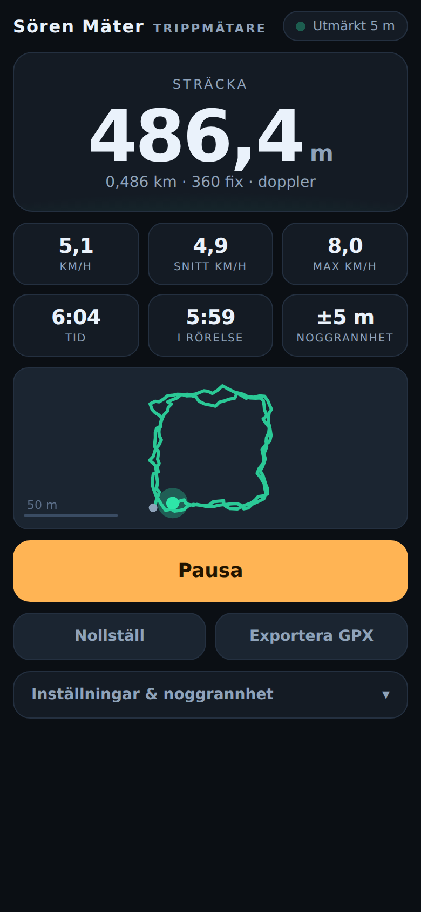

# Sören Mäter - trippmätare

En trippmätare för telefonen: den räknar **hur många meter du rör dig**, så exakt
som telefonens GPS tillåter. En enda HTML-fil, inget konto, inget nät efter första
laddningen, inga externa bibliotek.



## Använd den

1. Öppna sidan på telefonen (se *Publicera* nedan) — **måste vara `https://`**,
   annars vägrar webbläsaren lämna ut GPS.
2. Tryck **Starta** och godkänn platsåtkomst (välj *Exakt plats* om iOS frågar).
3. Vänta tills pricken uppe till höger blir grön (15–30 s första gången — GPS:en
   låser på satelliter). Sedan är varje meter du går med i sträckan.

Lägg gärna till sidan på hemskärmen (*Dela → Lägg till på hemskärmen*). Då startar
den i helskärm utan flikar, heter **Sören Mäter** under ikonen, och fungerar offline.

**Skärmen måste vara tänd.** Mobila webbläsare stoppar GPS-uppdateringar när
skärmen släcks — appen håller därför skärmen tänd åt dig (kan stängas av i
inställningarna). Bara en native-app kan mäta med släckt skärm.

## Så mäts sträckan

Att bara summera avstånden mellan GPS-punkter ger kraftigt uppblåsta värden: GPS:ens
brus är tidskorrelerat, så positionen vandrar flera meter fram och tillbaka även när
du står helt still. I simulering samlade den naiva metoden på sig **86 m på tre
minuter stillastående**. Sören Mäter gör i stället så här:

1. **Noggrannhetsgrind** — fix sämre än gränsen (25 m som standard) kastas helt.
2. **Kalman-filter** på positionen, med processbrus anpassat efter rörelsetyp.
   Filtrerade positioner används till kartan och GPX-spåret.
3. **Hastighet i första hand från dopplerskift.** `coords.speed` från telefonens
   GPS är en dopplermätning — samma princip som en bils GPS-hastighetsmätare — och
   är betydligt exaktare än att derivera positionen. Sträckan blir integralen av
   hastigheten: `Σ v·Δt`.
4. **Regression som reserv.** Saknar enheten hastighet (vissa datorer) skattas den
   med minsta-kvadratanpassning av positionen mot tiden över de senaste 13 sekunderna
   — mycket stabilare än att ta avståndet mellan två punkter.
5. **Stillhetsveto** — har nettoförflyttningen under de senaste 25 sekunderna varit
   mindre än 2,5 × positionsosäkerheten, och den utjämnade farten är låg, räknas
   ingenting alls. Det är detta som gör att mätaren står stilla när du står stilla.
6. **Rimlighetsspärr** — hopp som skulle innebära högre fart än rörelsetypen tillåter
   (t.ex. 200 km/h i läget Gång) kastas som skräpfix.
7. **Datalucka** — om det gått mer än 10 s mellan godkända fix används den faktiska
   förflyttningen i stället för att integrera en gammal hastighet.

### Uppmätt noggrannhet

`npm test` kör appen i en riktig webbläsare mot simulerade banor med känd längd
(σ = 5 m positionsbrus, korrelation 0,6, 1 Hz, dopplerbrus 0,3 m/s):

| Scenario | Sant | Mätt | Fel |
|---|---|---|---|
| står stilla 3 min | 0 m | 6,2 m | +6,2 m |
| gång 1,4 m/s, rakt | 280 m | 280,2 m | +0,1 % |
| gång med svängar | 280 m | 280,2 m | +0,1 % |
| gång runt kvarteret | 280 m | 280,2 m | +0,1 % |
| blandat gå/stå | 224 m | 221,8 m | −1,0 % |
| långsam gång 0,7 m/s | 140 m | 139,8 m | −0,1 % |
| löpning 3 m/s | 600 m | 598,6 m | −0,2 % |
| cykel 5,5 m/s | 1 100 m | 1 096,1 m | −0,4 % |
| bil 12 m/s | 2 400 m | 2 389,6 m | −0,4 % |
| dålig signal σ = 15 m | 280 m | 280,2 m | +0,1 % |
| *utan doppler:* gång | 280 m | 300,1 m | +7,2 % |
| *utan doppler:* står stilla | 0 m | 13,3 m | +13,3 m |

Parametrarna (vetofönster, trösklar, filterstyrka) är valda genom Monte
Carlo-svep över samma scenarier — inte gissade.

Verkligheten är stökigare än simuleringen: bland höga hus studsar signalen
(flervägsutbredning) och noggrannheten faller. Statusraden visar alltid vad GPS:en
själv rapporterar, så du ser när mätningen är att lita på.

## Inställningar

| Inställning | Vad den gör |
|---|---|
| **Rörelsetyp** | Sätter filterstyrka och rimlighetsspärr. *Rå* stänger av Kalman-filtret helt. |
| **Kräv noggrannhet bättre än** | Fix med sämre rapporterad noggrannhet kastas. Lägre = strängare, men riskerar att kasta allt i skog och stadskärna. |
| **Räknas som rörelse över** | Dödband: fart under detta räknas som stillastående. Höj om mätaren kryper när du står still. |
| **Håll skärmen tänd** | Wake Lock, så att GPS:en fortsätter leverera fix. |

Sträcka, spår och inställningar sparas löpande i `localStorage` — laddar sidan om
sig, eller trycker du fel, ligger allt kvar. **Nollställ** kräver dubbeltryck.
**Exportera GPX** ger en fil som kan öppnas i Strava, Garmin Connect, Google Earth
med flera.

## Publicera

Filerna är helt statiska — vilken https-värd som helst duger. Med GitHub Pages:

1. Repots **Settings → Pages**
2. *Source*: **Deploy from a branch**, branch `claude/tripp-meter-app-cypofz`, mapp `/ (root)`
3. Spara — appen hamnar på `https://<användarnamn>.github.io/background-/`

Lokalt: `npm run serve` och öppna `http://localhost:3000/` (GPS fungerar på
`localhost` utan https).

## Filer

| Fil | Innehåll |
|---|---|
| `index.html` | Hela appen — gränssnitt, filter, mätmotor, karta, GPX-export |
| `sw.js` | Service worker: cachar appen så den fungerar offline |
| `manifest.webmanifest`, `icon*.png`, `icon.svg` | Hemskärmsikon och app-läge |
| `test/accuracy.test.mjs` | Kör appen i Chromium mot simulerade banor och mäter felet |

## Kör testerna

```bash
npm install
npm test        # sätt CHROMIUM=/sökväg/till/chrome om webbläsaren inte hittas
```
